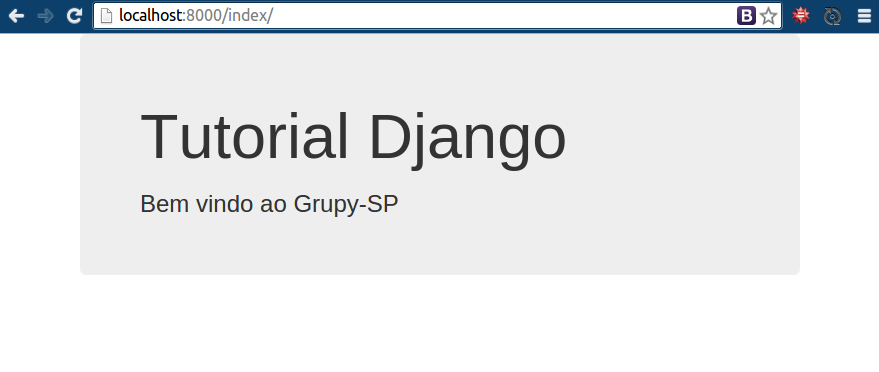
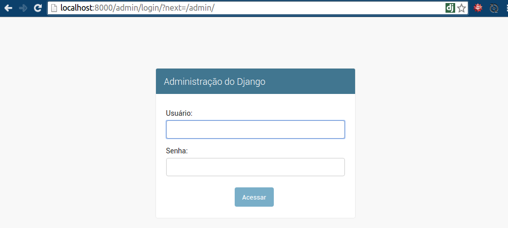
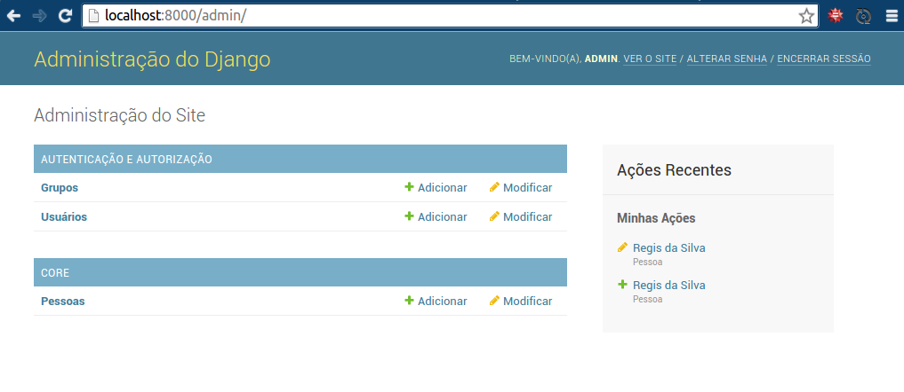
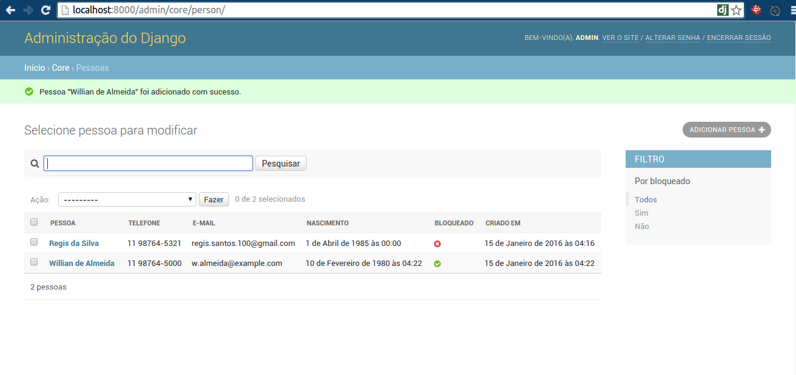
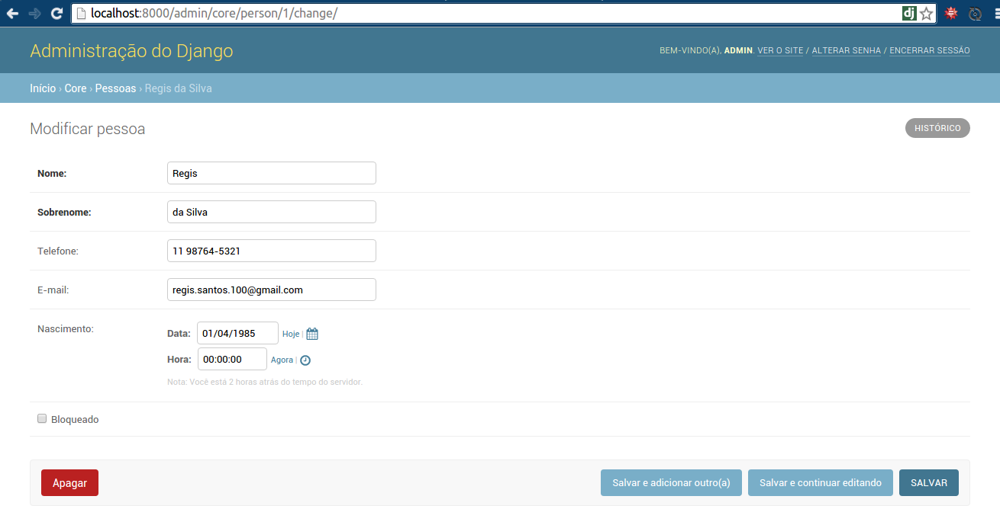

# Django simples

## Tutorial de Django para o Grupy-SP realizado dia 27/01/16.

### O script

```bash
wget --output-document=setup.sh link
source setup.sh myproject
```


### O passo a passo

Veja o que o script está fazendo:

```bash
mkdir djangoproject
cd djangoproject
virtualenv -p python3 .venv
source .venv/bin/activate
pip install django
pip freeze > requirements.txt
django-admin.py startproject myproject .
cd myproject
python ../manage.py startapp core
mkdir core/templates
touch core/templates/index.html
cd .. # estamos na pasta myproject
# Editar os arquivos settings.py, views.py, urls.py, models.py e admin.py
```


## Ementa

* Instalação
* Criar o ambiente
* [Criar o projeto e a App](#criando-o-projeto-e-a-app)


## Objetivo

* Criar a view mais simples do mundo
* Criar um cadastro de pessoas
* Editar os dados pelo Admin


## O que é Django?

Segundo Django Brasil,

*Django é um framework web de alto nível escrito em Python que estimula o desenvolvimento rápido e limpo.*

* adota o padrão MTV
* possui ORM
* admin
* herança de templates e modelos
* open source


## Versão atual (Jan/16)

```
Django==1.9.1
```

## Sites

https://www.djangoproject.com/

https://www.djangopackages.com/

http://tutorial.djangogirls.org/pt/index.html

https://groups.google.com/forum/#!forum/django-brasil

http://pythonclub.com.br/

https://realpython.com/blog/categories/django/

http://www.marinamele.com/taskbuster-django-tutorial


## Instalação

```bash
virtualenv -p python3 .venv
source .venv/bin/activate
pip install django
```

## Criando o projeto e a App

Tutorial Django: https://docs.djangoproject.com/en/1.9/intro/tutorial01/

### Criando o Projeto

```bash
$ django-admin.py startproject myproject .
```

repare no ponto final do comando, isto permite que o arquivo `manage.py` fique na pasta "principal", pasta **myproject**.

### Criando a App

```bash
$ python manage.py startapp core
```

O que temos até aqui?

```bash
$ tree
```

```
.
├── manage.py
└── myproject
    ├── __init__.py
    ├── settings.py
    ├── urls.py
    ├── wsgi.py
    └── core
        ├── admin.py
        ├── apps.py
        ├── __init__.py
        ├── models.py
        ├── tests.py
        └── views.py
```

### Relacionamento entre os arquivos do Django


**Tudo pode ser testado.**

## Django funcionando em nível 0

Criando a primeira migração

```bash
$ python manage.py migrate
```

Obs: o comando ``migrate`` se chamava ``syncdb`` e só era capaz de criar novas tabelas no banco de dados. Já o ``migrate`` consegue remover e alterar tabelas. Criado baseado nas funcionalidades do Django South.

```bash
$ python manage.py runserver
```

Por padrão ele está rodando na porta 8000

http://localhost:8000/ ou http://127.0.0.1:8000/

ou

```bash
$ python manage.py runserver <PORTA>
$ python manage.py runserver 8080
```

http://localhost:8080/


## O mínimo - nível 1: settings, views, urls

```
.
└── myproject
    ├── ...
    ├── settings.py
    ├── urls.py
    └── core
        ├── ...
        └── views.py
```


### Editando settings.py

```python
INSTALLED_APPS = (
    ...
    'myproject.core',
)
```

# A view mais simples do mundo

```python
# from django.shortcuts import render
from django.http import HttpResponse

def home(request):
    return HttpResponse('<h1>Django</h1><h3>Bem vindo ao Grupy-SP</h3>')
```


### Editando urls.py

```python
from django.conf.urls import url
import myproject.core.views as v

urlpatterns = [
    url(r'^$', v.home),
]
```


## Tocando o barco

### Editando settings.py

```python
LANGUAGE_CODE = 'pt-br'

TIME_ZONE = 'America/Sao_Paulo'
```

### Editando views.py

```python
from django.shortcuts import render
from django.http import HttpResponse

def home(request):
    return HttpResponse('<h1>Django</h1><h3>Bem vindo ao Grupy-SP</h3>')

def index(request):
    return render(request, 'index.html')
```

### Editando urls.py

```python
from django.conf.urls import url
import myproject.core.views as v
from django.contrib import admin

urlpatterns = [
    url(r'^$', v.home),
    url(r'^index/$', v.index),
    url(r'^admin/', admin.site.urls),
]
```

### Criando o template

```
.
├── manage.py
└── myproject
    ├── __init__.py
    ├── settings.py
    ├── urls.py
    ├── wsgi.py
    └── core
        ├── admin.py
        ├── apps.py
        ├── __init__.py
        ├── models.py
        ├── tests.py
        ├── views.py
        └── templates
            ├── index.html
```





### Editando o models.py

```python
from django.db import models

class Person(models.Model):
    first_name = models.CharField('nome', max_length=50)
    last_name = models.CharField('sobrenome', max_length=50)
    phone = models.CharField('telefone', max_length=20, blank=True)
    email = models.EmailField('e-mail', blank=True)
    blocked = models.BooleanField('bloqueado', default=False)
    created = models.DateTimeField('criado em', auto_now_add=True)

    class Meta:
        ordering = ['first_name']
        verbose_name = 'pessoa'
        verbose_name_plural = 'pessoas'

    def __str__(self):
        return ' '.join(filter(None, [self.first_name, self.last_name]))
```


### Tipos de campos

https://docs.djangoproject.com/en/1.9/ref/models/fields/


### Editando o admins.py

```python
from django.contrib import admin
from myproject.core.models import Person

class PersonModelAdmin(admin.ModelAdmin):
    list_display = ('__str__', 'phone', 'email', 'blocked', 'created')
    search_fields = ('first_name', 'last_name', 'phone', 'email')
    list_filter = ('blocked',)

admin.site.register(Person, PersonModelAdmin)
```


### Atualizando o banco

```bash
$ python manage.py makemigrations
$ python manage.py migrate
```


### Admin

    $ python manage.py createsuperuser --username='admin' --email=''










## Mais tutoriais

[Principais dúvidas de quem quer aprender Django](http://pythonclub.com.br/principais-duvidas-de-quem-quer-aprender-django.html)

[Como criar um site com formulário e lista em 30 minutos?](http://pythonclub.com.br/criar-site-com-form-lista-30-min.html)

[Tutorial Django 1.7](http://pythonclub.com.br/tutorial-django-17.html) + video

[Palestra sobre Django no Grupy-SP Setembro/2015](https://github.com/grupy-sp/encontros/blob/master/2015-09-pagar-me.md)

[Explorando o ORM do Django (modelagem de dados) + Criando sua própria fixtures](https://github.com/grupy-sp/encontros/blob/master/2015-10-bandtec.md#30-min-explorando-o-orm-do-django-modelagem-de-dados--criando-sua-própria-fixtures---régis-silva)

[Tutorial Djangogirls](http://tutorial.djangogirls.org/pt/index.html)


## Livros

* Django Essencial de Julia Elman da Novatec

http://www.novatec.com.br/livros/django/

* Two Scoops of Django 1.8 de Daniel and Audrey Roy Greenfeld (Py Danny)

http://twoscoopspress.org/pages/current-django-books

http://djangoteca.info/livros/django/

* Django Book online

http://www.djangobook.com/en/2.0/index.html

* Django by Example

https://www.packtpub.com/web-development/django-example


## Cursos

* Welcome to the Django (online) com Henrique Bastos

http://welcometothedjango.com.br/

* PyCursos (online) Jornada Django com Gileno Filho

http://pycursos.com/django/


## YouTube

* Python para Zumbis - https://goo.gl/swsHmw
* Django para Iniciantes por Allisson Azevedo - https://goo.gl/38ttOb
* CodingEntrepreneurs Try Django 1.8 - https://goo.gl/HNxRou